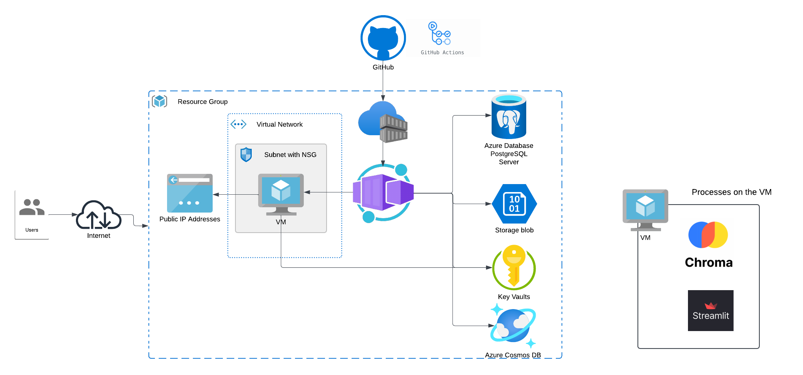

# Stage10-docker-conatiner

# 🤖 Azure Chatbot Infrastructure with Terraform

This project builds a secure and scalable **chatbot backend infrastructure** on Azure using **Terraform**. It provisions key services like a containerized **FastAPI app**, a **ChromaDB + Streamlit VM**, **PostgreSQL**, **Cosmos DB**, and **Azure Key Vault**, all inside a managed **VNet**.

---

## 🧱 Components

- **Azure Container App** → Hosts the FastAPI chatbot API
- **VM (in subnet)** → Hosts Streamlit UI + ChromaDB for embeddings
- **PostgreSQL DB** → Stores structured chat data
- **Cosmos DB** → Stores unstructured/conversational data
- **Azure Storage** → Holds user files via Blob container
- **Azure Key Vault** → Secures secrets like DB passwords and API keys
- **VNet + Subnet + NSG** → Ensures secure private networking

---

## 📌 Architecture

  
*Diagram showing Container App, VM in subnet, PostgreSQL, Cosmos DB, Storage, Key Vault, and NSG inside a VNet.*

